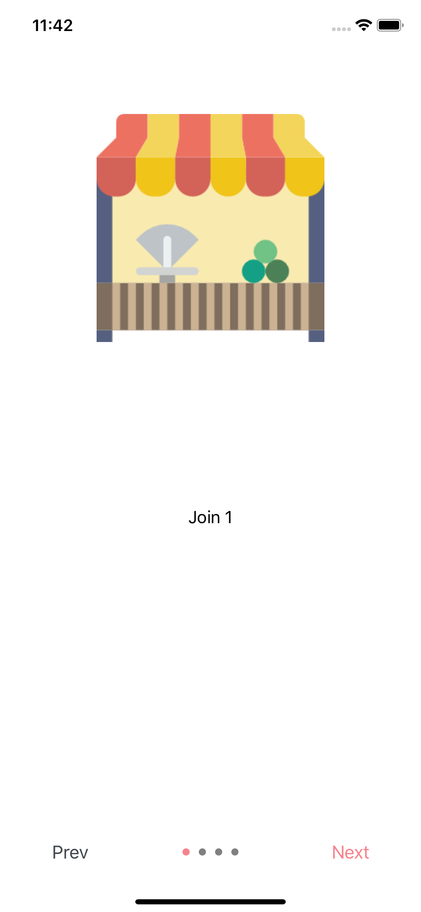
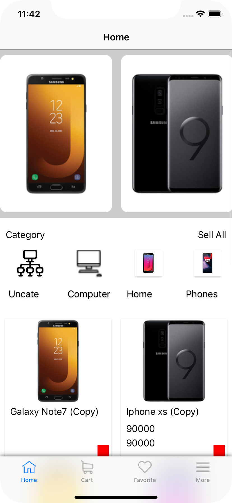
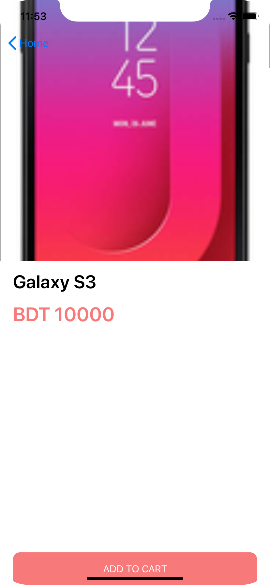

# ALI-BHAI
### E-commerce APP based on  <a href="https://woocommerce.github.io/woocommerce-rest-api-docs/">woocommerce API</a>

------------------------------------------------------------------------------------ 

### How to use?

  `pod install`
  
  `Xcode > Run`

---------------------------------------------------------------
### PAGES
    - Splash screen (DONE)
    - Introduction screen (DONE)
    - Home page (DONE)
    - Product Details (IN PROGESS)
    - Cart Page(UP COMMING)
    - Checkout Page(UP COMMING)
    - Payment Page (UP COMMING)
    - User Registration/ Login (UP COMMING)

 
 
 
 

